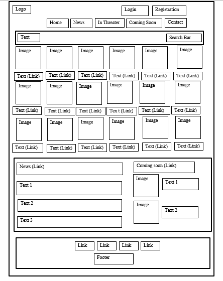
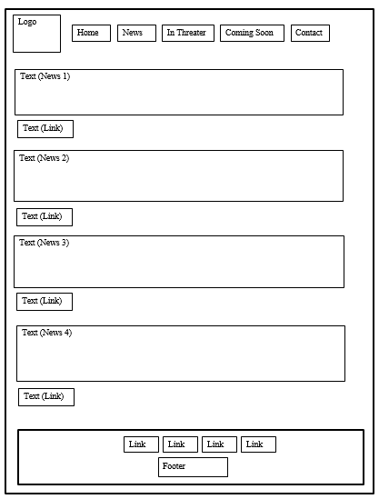
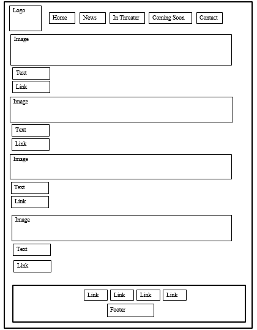
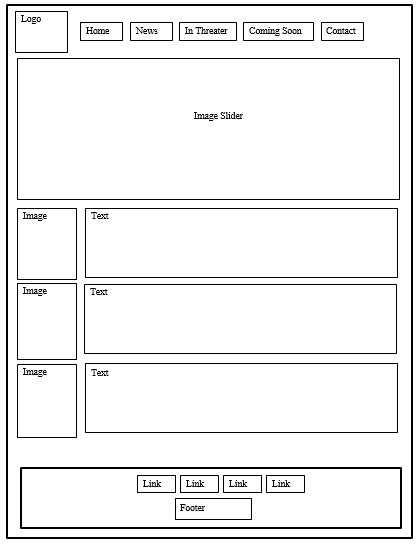

# Watch-Trailer



## Table of Contents

- [Introduction](#introduction)
- [Features](#features)
- [Installation](#installation)
- [Usage](#usage)
- [Screenshots](#screenshots)
- [Technologies Used](#technologies-used)
- [Contributing](#contributing)
- [License](#license)

## Introduction

Watch-Trailer is a web application designed to provide users with an immersive movie browsing and ticket booking experience. Users can view upcoming movies, watch trailers, and book tickets for their favorite movies all in one place.

## Features

- Browse and book tickets for movies currently in theaters.
- Watch trailers of upcoming movies.
- User registration and login functionality.
- Responsive design for an optimal viewing experience on all devices.
- Latest movie news and updates.

## Installation

To run this project locally, follow these steps:

1. Clone the repository:
    ```bash
    git clone https://github.com/your-username/Watch-Trailer.git
    cd Watch-Trailer
    ```

2. Open the `index.html` file in your preferred web browser.

## Usage

- **Home Page**: View the latest movies and watch trailers.
- **Book Tickets**: Navigate to the booking page to purchase tickets for your favorite movies.
- **Login/Registration**: Create an account or log in to book tickets and access personalized features.
- **News**: Stay updated with the latest news about upcoming movies and events.

## Screenshots






## Technologies Used

- **HTML5**: For the structure and content of the web pages.
- **CSS3**: For styling and layout.
- **JavaScript (jQuery)**: For dynamic content and user interaction.

## Contributing

We welcome contributions to improve Watch-Trailer! If you have suggestions for enhancements or encounter any issues, please feel free to submit a pull request or open an issue.
